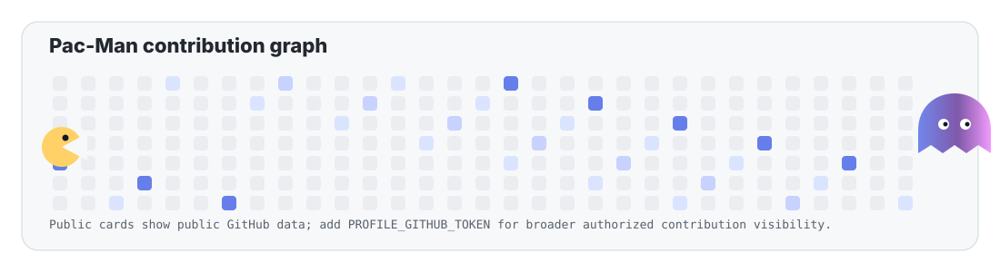

  

  
  
  
  
  
  

  

  

  

<table>
  <tr>
    <td width="50%" valign="top">
      <pre><code class="language-yaml">name: Mridul Khanna
location: Toronto, Canada
role: Senior Full-Stack Software Engineer
experience: 10 years
expertise:
  - Java and Spring Boot services
  - Angular and React frontends
  - TypeScript and JavaScript applications
  - REST API design and integration
  - SQL, Hibernate, and JPA
  - Maven, Git, Jenkins, and Linux
currently_deepening:
  - AWS and Docker
  - CI/CD and cloud architecture
  - System design
  - AI-assisted software development
mission: Build secure, scalable and maintainable software.</code></pre>
    </td>
    <td width="50%" valign="top">
      <h3>Current focus</h3>
      <ul>
        <li>Modern enterprise full-stack delivery across frontend, backend, and data layers.</li>
        <li>Application modernization with maintainable architecture and pragmatic migration paths.</li>
        <li>Cloud-ready engineering practices across AWS, Docker, CI/CD, and system design.</li>
        <li>Applied AI and developer productivity workflows that improve software delivery.</li>
      </ul>
      <h3>Quick facts</h3>
      <ul>
        <li>Based in Toronto, Canada.</li>
        <li>10 years of professional software engineering experience.</li>
        <li>Comfortable bridging product needs, implementation details, and production realities.</li>
      </ul>
      <h3>Technical leadership strengths</h3>
      <ul>
        <li>Code reviews and engineering standards.</li>
        <li>Unit testing, maintainability, and delivery quality.</li>
        <li>Cross-team collaboration and solution-oriented architecture discussions.</li>
      </ul>
    </td>
  </tr>
</table>

  

  

<table>
  <tr>
    <td width="25%" valign="top">
      <h3>Architecture</h3>
      
Designing maintainable enterprise applications with clear boundaries, API-first thinking, and change-friendly structures.

      <ul>
        <li>Clean architecture</li>
        <li>Solution design</li>
        <li>System decomposition</li>
      </ul>
    </td>
    <td width="25%" valign="top">
      <h3>Full-stack delivery</h3>
      
Integrating Angular and React frontends with Java, Spring Boot, REST APIs, SQL, Hibernate, and JPA.

      <ul>
        <li>Frontend/backend integration</li>
        <li>Angular modernization</li>
        <li>Production delivery</li>
      </ul>
    </td>
    <td width="25%" valign="top">
      <h3>Engineering quality</h3>
      
Keeping code reliable through unit testing, code reviews, secure development practices, and pragmatic standards.

      <ul>
        <li>Code quality</li>
        <li>Unit testing</li>
        <li>Secure implementation</li>
      </ul>
    </td>
    <td width="25%" valign="top">
      <h3>Technical leadership</h3>
      
Supporting teams through technical decisions, delivery planning, migration work, and cross-functional collaboration.

      <ul>
        <li>Technical guidance</li>
        <li>Team collaboration</li>
        <li>Delivery ownership</li>
      </ul>
    </td>
  </tr>
</table>

<!-- 

  

  

> Most of my professional engineering work is completed in private enterprise repositories, so my public GitHub activity represents only part of my overall experience. The analytics below use public GitHub data only; private repositories and employer contributions are not exposed to these third-party cards.

  <picture>
    <source media="(prefers-color-scheme: dark)" srcset="https://github-profile-summary-cards.vercel.app/api/cards/stats?username=muscledevnerd&theme=github_dark" />
    <source media="(prefers-color-scheme: light)" srcset="https://github-profile-summary-cards.vercel.app/api/cards/stats?username=muscledevnerd&theme=github" />
    
  </picture>
  <picture>
    <source media="(prefers-color-scheme: dark)" srcset="https://streak-stats.demolab.com?user=muscledevnerd&theme=tokyonight&hide_border=true&background=0D1117&stroke=667EEA&ring=764BA2&fire=F093FB&currStreakLabel=C9D1D9&sideLabels=C9D1D9&currStreakNum=C9D1D9&sideNums=C9D1D9&dates=8B949E" />
    <source media="(prefers-color-scheme: light)" srcset="https://streak-stats.demolab.com?user=muscledevnerd&theme=default&hide_border=true" />
    
  </picture>

  <picture>
    <source media="(prefers-color-scheme: dark)" srcset="https://github-profile-summary-cards.vercel.app/api/cards/profile-details?username=muscledevnerd&theme=github_dark" />
    <source media="(prefers-color-scheme: light)" srcset="https://github-profile-summary-cards.vercel.app/api/cards/profile-details?username=muscledevnerd&theme=github" />
    
  </picture>

  <picture>
    <source media="(prefers-color-scheme: dark)" srcset="https://github-profile-summary-cards.vercel.app/api/cards/productive-time?username=muscledevnerd&theme=github_dark&utcOffset=-4" />
    <source media="(prefers-color-scheme: light)" srcset="https://github-profile-summary-cards.vercel.app/api/cards/productive-time?username=muscledevnerd&theme=github&utcOffset=-4" />
    
  </picture>
  <picture>
    <source media="(prefers-color-scheme: dark)" srcset="https://github-profile-summary-cards.vercel.app/api/cards/repos-per-language?username=muscledevnerd&theme=github_dark" />
    <source media="(prefers-color-scheme: light)" srcset="https://github-profile-summary-cards.vercel.app/api/cards/repos-per-language?username=muscledevnerd&theme=github" />
    
  </picture>

  <picture>
    <source media="(prefers-color-scheme: dark)" srcset="https://github-profile-summary-cards.vercel.app/api/cards/most-commit-language?username=muscledevnerd&theme=github_dark" />
    <source media="(prefers-color-scheme: light)" srcset="https://github-profile-summary-cards.vercel.app/api/cards/most-commit-language?username=muscledevnerd&theme=github" />
    
  </picture>

  <h3>Pac-Man contribution graph</h3>
  <picture>
    <source media="(prefers-color-scheme: dark)" srcset="./assets/pacman-contribution-graph-dark.svg" />
    <source media="(prefers-color-scheme: light)" srcset="./assets/pacman-contribution-graph.svg" />
    
  </picture>

  

 -->

  

<table align="center">
  <tr>
    <td width="50%" valign="top" align="center">
      <h3>Backend</h3>
      

        
        
        
        
      

      <h3>Frontend</h3>
      

        
        
        
        
        
        
        
      

    </td>
    <td width="50%" valign="top" align="center">
      <h3>Data</h3>
      

        
        
        
      

      <h3>Cloud and DevOps</h3>
      

        
        
        
        
        
      

      <h3>Development tools</h3>
      

        
        
        
        
        
        
      

    </td>
  </tr>
</table>

### Current focus

  
  
  
  
  
  

  
<strong>Learning roadmap</strong>

  - <strong>Advanced Java:</strong> concurrency, performance tuning, modern language features, and JVM diagnostics.
  - <strong>Spring Boot:</strong> security, observability, resilient integrations, and production-grade service design.
  - <strong>System design:</strong> scalability patterns, trade-off analysis, distributed systems fundamentals, and architecture documentation.
  - <strong>AWS:</strong> core services, secure deployment models, networking basics, and operational practices.
  - <strong>Docker:</strong> image optimization, local development workflows, and containerized service delivery.
  - <strong>CI/CD:</strong> GitHub Actions, Jenkins pipelines, quality gates, release safety, and deployment automation.
  - <strong>Data structures and algorithms:</strong> problem-solving fluency, complexity analysis, and interview-ready fundamentals.
  - <strong>AI-assisted engineering:</strong> code review acceleration, documentation support, test generation, and developer productivity tools.

  

## Engineering philosophy

### Clarity in design. Discipline in delivery. Trust in every release.

I value software that communicates intent clearly, protects users and business workflows, scales without unnecessary complexity, and gives teams the confidence to change it through strong tests, clean boundaries, and practical engineering discipline.

  

  

  
  
  

  

