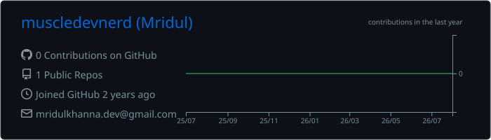
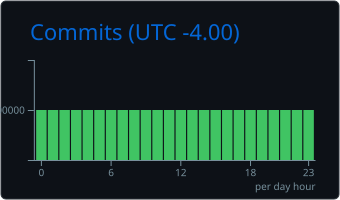
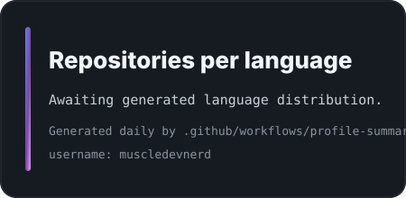
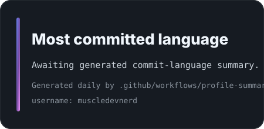

  

  
  
  
  
  
  

  

  

  

<table>
  <tr>
    <td width="50%" valign="top">
      <pre><code class="language-yaml">name: Mridul Khanna
location: Toronto, Canada
role: Senior Full-Stack Software Engineer
experience: 10 years
expertise:
  - Java and Spring Boot services
  - Angular and React frontends
  - TypeScript and JavaScript applications
  - REST API design and integration
  - SQL, Hibernate, and JPA
  - Maven, Git, Jenkins, and Linux
currently_deepening:
  - AWS and Docker
  - CI/CD and cloud architecture
  - System design
  - AI-assisted software development
mission: Build secure, scalable and maintainable software.</code></pre>
    </td>
    <td width="50%" valign="top">
      <h3>Current focus</h3>
      <ul>
        <li>Modern enterprise full-stack delivery across frontend, backend, and data layers.</li>
        <li>Application modernization with maintainable architecture and pragmatic migration paths.</li>
        <li>Cloud-ready engineering practices across AWS, Docker, CI/CD, and system design.</li>
        <li>Applied AI and developer productivity workflows that improve software delivery.</li>
      </ul>
      <h3>Quick facts</h3>
      <ul>
        <li>Based in Toronto, Canada.</li>
        <li>10 years of professional software engineering experience.</li>
        <li>Comfortable bridging product needs, implementation details, and production realities.</li>
      </ul>
      <h3>Technical leadership strengths</h3>
      <ul>
        <li>Code reviews and engineering standards.</li>
        <li>Unit testing, maintainability, and delivery quality.</li>
        <li>Cross-team collaboration and solution-oriented architecture discussions.</li>
      </ul>
    </td>
  </tr>
</table>

  

  

<table>
  <tr>
    <td width="25%" valign="top">
      <h3>Architecture</h3>
      
Designing maintainable enterprise applications with clear boundaries, API-first thinking, and change-friendly structures.

      <ul>
        <li>Clean architecture</li>
        <li>Solution design</li>
        <li>System decomposition</li>
      </ul>
    </td>
    <td width="25%" valign="top">
      <h3>Full-stack delivery</h3>
      
Integrating Angular and React frontends with Java, Spring Boot, REST APIs, SQL, Hibernate, and JPA.

      <ul>
        <li>Frontend/backend integration</li>
        <li>Angular modernization</li>
        <li>Production delivery</li>
      </ul>
    </td>
    <td width="25%" valign="top">
      <h3>Engineering quality</h3>
      
Keeping code reliable through unit testing, code reviews, secure development practices, and pragmatic standards.

      <ul>
        <li>Code quality</li>
        <li>Unit testing</li>
        <li>Secure implementation</li>
      </ul>
    </td>
    <td width="25%" valign="top">
      <h3>Technical leadership</h3>
      
Supporting teams through technical decisions, delivery planning, migration work, and cross-functional collaboration.

      <ul>
        <li>Technical guidance</li>
        <li>Team collaboration</li>
        <li>Delivery ownership</li>
      </ul>
    </td>
  </tr>
</table>

  

  

> Most of my professional engineering work is completed in private enterprise repositories, so my public GitHub activity represents only part of my overall experience.

  
  

  

  

  
  

  
  

### Contribution animation

  <picture>
    <source media="(prefers-color-scheme: dark)" srcset="./assets/pacman-contribution-graph-dark.svg" />
    <source media="(prefers-color-scheme: light)" srcset="./assets/pacman-contribution-graph.svg" />
    
  </picture>

  

  

<table>
  <tr>
    <td width="50%" valign="top">
      <h3>Backend</h3>
      

        
        
        
        
      

      <h3>Frontend</h3>
      

        
        
        
        
        
        
        
      

    </td>
    <td width="50%" valign="top">
      <h3>Data</h3>
      

        
        
        
      

      <h3>Cloud and DevOps</h3>
      

        
        
        
        
        
      

      <h3>Development tools</h3>
      

        
        
        
        
        
        
      

    </td>
  </tr>
</table>

### Current focus

  
  
  
  
  
  

  

  

<table>
  <tr>
    <td width="33%" valign="top">
      <h3>Enterprise workflow platform</h3>
      
<strong>Problem:</strong> Coordinate complex business workflows with clear auditability and maintainable service boundaries.

      
<strong>Main technologies:</strong> Java, Spring Boot, Angular, SQL, REST APIs.

      <ul>
        <li>Role-based workflow orchestration.</li>
        <li>API contracts designed for frontend/backend alignment.</li>
        <li>Testable domain logic and integration seams.</li>
      </ul>
      <!-- TODO: Replace placeholders below with the real repository, demo, and architecture documentation links. -->
      
<a href="#">Repository placeholder</a> &middot; <a href="#">Live demo placeholder</a> &middot; <a href="#">Architecture docs placeholder</a>

    </td>
    <td width="33%" valign="top">
      <h3>Developer productivity dashboard</h3>
      
<strong>Problem:</strong> Surface delivery signals, engineering metrics, and workflow bottlenecks in one practical view.

      
<strong>Main technologies:</strong> React, TypeScript, REST APIs, GitHub Actions, Bootstrap.

      <ul>
        <li>Composable dashboard cards for engineering insights.</li>
        <li>Clean data-fetching boundaries and reusable UI patterns.</li>
        <li>Automation-ready reporting concepts.</li>
      </ul>
      <!-- TODO: Replace placeholders below with the real repository, demo, and architecture documentation links. -->
      
<a href="#">Repository placeholder</a> &middot; <a href="#">Live demo placeholder</a> &middot; <a href="#">Architecture docs placeholder</a>

    </td>
    <td width="33%" valign="top">
      <h3>Cloud-native API service</h3>
      
<strong>Problem:</strong> Provide a secure, scalable API foundation for modern cloud-hosted applications.

      
<strong>Main technologies:</strong> Spring Boot, Docker, AWS, SQL, CI/CD.

      <ul>
        <li>Container-first service design.</li>
        <li>Health checks, configuration hygiene, and deployment readiness.</li>
        <li>Clear API versioning and persistence boundaries.</li>
      </ul>
      <!-- TODO: Replace placeholders below with the real repository, demo, and architecture documentation links. -->
      
<a href="#">Repository placeholder</a> &middot; <a href="#">Live demo placeholder</a> &middot; <a href="#">Architecture docs placeholder</a>

    </td>
  </tr>
</table>

  
<strong>Learning roadmap</strong>

  - <strong>Advanced Java:</strong> concurrency, performance tuning, modern language features, and JVM diagnostics.
  - <strong>Spring Boot:</strong> security, observability, resilient integrations, and production-grade service design.
  - <strong>System design:</strong> scalability patterns, trade-off analysis, distributed systems fundamentals, and architecture documentation.
  - <strong>AWS:</strong> core services, secure deployment models, networking basics, and operational practices.
  - <strong>Docker:</strong> image optimization, local development workflows, and containerized service delivery.
  - <strong>CI/CD:</strong> GitHub Actions, Jenkins pipelines, quality gates, release safety, and deployment automation.
  - <strong>Data structures and algorithms:</strong> problem-solving fluency, complexity analysis, and interview-ready fundamentals.
  - <strong>AI-assisted engineering:</strong> code review acceleration, documentation support, test generation, and developer productivity tools.

  

## Engineering philosophy

### Build for today. Design for change. Engineer for trust.

I value software that is maintainable enough to evolve, reliable enough to support real users, secure enough to protect business workflows, scalable enough to grow with demand, testable enough to change with confidence, and simple enough for the next engineer to understand.

  

  

  
  
  

  

